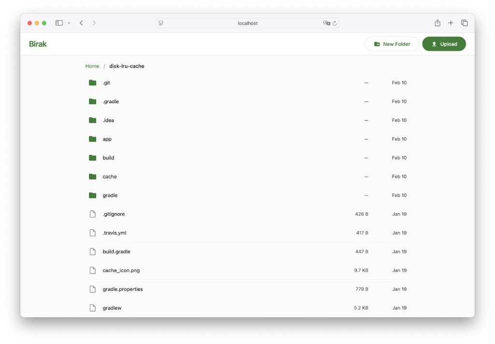

# Birak — Distributed File Server

Birak is a distributed file server with built-in replication. Each node stores a full copy of the data and automatically keeps it in sync with other nodes over the network. Files are accessible via S3 API, WebDAV, SFTP, HTTP file browser, or the local filesystem — use whichever protocol fits your workflow.

<p align="center">
  
</p>

## Key Features

- **Multi-protocol access** — S3 API, WebDAV, SFTP, HTTP file browser, or direct filesystem.
- **S3 multipart uploads** — crash-safe, resumable parallel uploads with TTL cleanup and per-part checksums.
- **Automatic replication** — nodes discover changes in real time and replicate them to all peers.
- **Recoverable replication** — durable repairs retain failed operations, periodic manifest reconciliation checks divergence, and checksum scans detect changes missed by filesystem events.
- **Conflict resolution** — a per-path logical clock with deterministic tie-breaks, shared by polling, repairs, and reconciliation.
- **No single point of failure** — every node is equal; any node can accept reads and writes.
- **Zero external dependencies** — single Go binary, embedded SQLite for metadata.

## How It Works

A Birak cluster consists of one or more **nodes**. Each node has two directories:

- **sync_dir** — the directory where your files live. Any file you put here (or upload via S3/WebDAV/SFTP/browser) gets replicated to all other nodes.
- **meta_dir** — internal directory for the SQLite database that tracks file versions and sync state. You don't need to touch this.

Nodes know about each other through a **peers** list in the config. Each node polls its peers for changes and downloads new or updated files automatically. There is no central server — every node is a full replica.

Files can arrive through `cp`, `rsync`, an application, or S3/WebDAV/SFTP/browser. For direct filesystem updates, publish atomically and change the mtime when replacing bytes. An unexplained checksum change with identical size and mtime is quarantined and repaired from a healthy peer; use a gateway when intentionally preserving both attributes. Once synced, files are accessible through any supported protocol.

## Quick Start

### Docker

The fastest way to try Birak — no config file needed:

```bash
docker run -d \
  -e BIRAK_HTTP_ENABLED=true \
  -v ./sync:/data/sync \
  -v ./meta:/data/meta \
  -p 9100:9100 \
  -p 9400:9400 \
  solkin/birak:latest
```

Open `http://localhost:9400` — you'll see the file browser. Upload a file, and it will appear in the `./sync` directory on your host machine.

### Docker Compose (2-node cluster)

To see replication in action, run two nodes:

```yaml
# docker-compose.yaml
services:
  node1:
    image: solkin/birak:latest
    environment:
      BIRAK_NODE_ID: "node-1"
      BIRAK_PEERS: "http://node2:9100"
      BIRAK_HTTP_ENABLED: "true"
    volumes:
      - node1-sync:/data/sync
      - node1-meta:/data/meta
    ports:
      - "9101:9100"
      - "9401:9400"

  node2:
    image: solkin/birak:latest
    environment:
      BIRAK_NODE_ID: "node-2"
      BIRAK_PEERS: "http://node1:9100"
      BIRAK_HTTP_ENABLED: "true"
    volumes:
      - node2-sync:/data/sync
      - node2-meta:/data/meta
    ports:
      - "9102:9100"
      - "9402:9400"

volumes:
  node1-sync:
  node1-meta:
  node2-sync:
  node2-meta:
```

```bash
docker compose up -d
```

Open `http://localhost:9401` and `http://localhost:9402` — upload a file on one node and watch it appear on the other.

### Build from Source

```bash
go build -o birakd ./cmd/birakd
./birakd -config config.yaml
```

The daemon will create `sync_dir` and `meta_dir` if they don't exist, open a SQLite database at `meta_dir/birak.db`, and start synchronizing.

To stop — send `SIGINT` or `SIGTERM` (Ctrl+C). The daemon will gracefully finish all in-progress operations.

## Configuration

Birak can be configured via a YAML file, environment variables, or both. Environment variables take precedence over the config file. The config file itself is optional — you can run Birak entirely with env vars.

### YAML config file

```bash
./birakd -config config.yaml
```

**Minimal:**
```yaml
node_id: "node-1"
peers:
  - "http://192.168.1.2:9100"
```

**Full example:**
```yaml
node_id: "node-1"
sync_dir: "/data/sync"
meta_dir: "/data/meta"
listen_addr: ":9100"
log_level: "info"           # debug | info | warn | error
peers:
  - "http://192.168.1.2:9100"
  - "http://192.168.1.3:9100"
ignore:
  - ".DS_Store"
  - "Thumbs.db"
  - "*.swp"
max_upload_bytes: 1073741824   # 1 GiB cap per upload; 0 = unlimited except HTTP UI (1 GiB default)
multipart:                    # S3 multipart upload limits and retention
  min_part_bytes: 5242880     # 5 MiB — minimum size of every part but the last
  max_part_bytes: 5368709120  # 5 GiB — maximum size of a single part
  max_parts: 10000            # highest accepted part number
  max_active_uploads: 10000   # simultaneously staged uploads; 0 = unlimited
  max_concurrent_part_uploads: 0  # in-flight part uploads; 0 = unlimited
  upload_ttl: 168h            # discard an untouched incomplete upload after this
  cleanup_interval: 1h        # how often the janitor sweeps
  temp_file_max_age: 24h      # age at which an orphaned scratch file is removed
cluster_secret: "shared-secret"  # required on every peer-to-peer request; omit to leave the sync API open
sync:
  poll_interval: 3s
  batch_limit: 1000
  max_concurrent_downloads: 5
  tombstone_ttl: 168h       # legacy setting; automatic tombstone GC is disabled
  scan_interval: 5m           # stat-only sweep; no longer re-reads file bytes
  scrub_bytes_per_second: 8388608  # continuous checksum verification budget; 0 disables
  max_repair_queue: 100000    # queued entries per peer; 0 = unlimited
  reconcile_page_budget: 64   # manifest pages per pass; 0 = the whole manifest at once
  debounce_window: 300ms
  repair_interval: 30s      # how often failed changes are retried
  reconcile_interval: 1h    # full manifest comparison with every peer
gateways:
  s3:
    enabled: true
    listen_addr: ":9200"
    access_key: "admin"
    secret_key: "secret123"
  webdav:
    enabled: true
    listen_addr: ":9300"
    username: "user"
    password: "secret123"
  http:
    enabled: true
    listen_addr: ":9400"
    username: "user"
    password: "secret123"
  sftp:
    enabled: true
    listen_addr: ":9500"
    username: "user"
    password: "secret123"
```

The `ignore`, `multipart`, and `sync` sections are optional — defaults will be used if omitted. Internal state (`.birak/`) and scratch files (`.birak-tmp-*`, `.birak-bak-*`) are always ignored regardless of configuration. Ignore rules only exclude files from replication; directory cleanup never deletes their contents. A directory containing ignored files is retained.

### Environment variables

Every setting has a corresponding `BIRAK_*` environment variable. Useful for Docker and CI/CD. List values (peers, ignore) are comma-separated.

```bash
export BIRAK_NODE_ID="node-1"
export BIRAK_PEERS="http://192.168.1.2:9100,http://192.168.1.3:9100"
export BIRAK_HTTP_ENABLED=true
./birakd
```

### Reference

| YAML | Env var | Default | Description |
|------|---------|---------|-------------|
| `node_id` | `BIRAK_NODE_ID` | `node-1` | Unique node ID |
| `sync_dir` | `BIRAK_SYNC_DIR` | `./sync` | Directory to synchronize |
| `meta_dir` | `BIRAK_META_DIR` | `./meta` | Directory for SQLite database |
| `listen_addr` | `BIRAK_LISTEN_ADDR` | `:9100` | Peer-to-peer HTTP server address |
| `peers` | `BIRAK_PEERS` | `[]` | Peer URLs (comma-separated in env) |
| `ignore` | `BIRAK_IGNORE` | `[]` | Ignore patterns (comma-separated in env) |
| `cluster_secret` | `BIRAK_CLUSTER_SECRET` | _(empty)_ | Shared secret required on peer-to-peer requests; empty leaves the sync API open |
| `log_level` | `BIRAK_LOG_LEVEL` | `info` | `debug`, `info`, `warn` or `error` |
| `max_upload_bytes` | `BIRAK_MAX_UPLOAD_BYTES` | `0` | Max upload bytes; 0 = unlimited for S3/WebDAV/SFTP, 1 GiB default for HTTP UI |
| `multipart.min_part_bytes` | `BIRAK_MULTIPART_MIN_PART_BYTES` | `5242880` | Minimum size of every multipart part but the last |
| `multipart.max_part_bytes` | `BIRAK_MULTIPART_MAX_PART_BYTES` | `5368709120` | Maximum size of a single multipart part |
| `multipart.max_parts` | `BIRAK_MULTIPART_MAX_PARTS` | `10000` | Highest accepted part number |
| `multipart.max_active_uploads` | `BIRAK_MULTIPART_MAX_ACTIVE_UPLOADS` | `10000` | Simultaneously staged uploads; 0 = unlimited |
| `multipart.max_concurrent_part_uploads` | `BIRAK_MULTIPART_MAX_CONCURRENT_PART_UPLOADS` | `0` | In-flight part uploads; 0 = unlimited |
| `multipart.upload_ttl` | `BIRAK_MULTIPART_UPLOAD_TTL` | `168h` | Retention for untouched incomplete uploads |
| `multipart.cleanup_interval` | `BIRAK_MULTIPART_CLEANUP_INTERVAL` | `1h` | Janitor sweep interval |
| `multipart.temp_file_max_age` | `BIRAK_MULTIPART_TEMP_FILE_MAX_AGE` | `24h` | Age for orphaned atomic-write scratch cleanup |
| `sync.poll_interval` | `BIRAK_SYNC_POLL_INTERVAL` | `3s` | Peer polling interval |
| `sync.batch_limit` | `BIRAK_SYNC_BATCH_LIMIT` | `1000` | Max entries per sync request |
| `sync.max_concurrent_downloads` | `BIRAK_SYNC_MAX_CONCURRENT_DOWNLOADS` | `5` | Combined polling and repair downloads per peer; also bounds active repair operations |
| `sync.tombstone_ttl` | `BIRAK_SYNC_TOMBSTONE_TTL` | `168h` | Legacy compatibility setting; tombstones are retained indefinitely |
| `sync.scan_interval` | `BIRAK_SYNC_SCAN_INTERVAL` | `5m` | Stat-only sweep interval; indexes anything whose size or timestamp moved |
| `sync.scrub_bytes_per_second` | `BIRAK_SYNC_SCRUB_BYTES_PER_SECOND` | `8388608` | Continuous checksum verification budget; 0 disables verification |
| `sync.max_repair_queue` | `BIRAK_SYNC_MAX_REPAIR_QUEUE` | `100000` | Queued repair entries per peer; 0 = unlimited |
| `sync.reconcile_page_budget` | `BIRAK_SYNC_RECONCILE_PAGE_BUDGET` | `64` | Manifest pages per comparison pass; 0 compares the whole manifest at once |
| `sync.debounce_window` | `BIRAK_SYNC_DEBOUNCE_WINDOW` | `300ms` | Delay before processing file events |
| `sync.repair_interval` | `BIRAK_SYNC_REPAIR_INTERVAL` | `30s` | Rescan interval for new or due repairs; free workers also refill on completion |
| `sync.reconcile_interval` | `BIRAK_SYNC_RECONCILE_INTERVAL` | `1h` | Full manifest comparison interval (0 disables — not recommended) |
| `gateways.s3.enabled` | `BIRAK_S3_ENABLED` | `false` | Enable S3 Gateway |
| `gateways.s3.listen_addr` | `BIRAK_S3_LISTEN_ADDR` | `:9200` | S3 Gateway address |
| `gateways.s3.access_key` | `BIRAK_S3_ACCESS_KEY` | _(empty)_ | S3 access key |
| `gateways.s3.secret_key` | `BIRAK_S3_SECRET_KEY` | _(empty)_ | S3 secret key |
| `gateways.webdav.enabled` | `BIRAK_WEBDAV_ENABLED` | `false` | Enable WebDAV Gateway |
| `gateways.webdav.listen_addr` | `BIRAK_WEBDAV_LISTEN_ADDR` | `:9300` | WebDAV Gateway address |
| `gateways.webdav.username` | `BIRAK_WEBDAV_USERNAME` | _(empty)_ | WebDAV username |
| `gateways.webdav.password` | `BIRAK_WEBDAV_PASSWORD` | _(empty)_ | WebDAV password |
| `gateways.http.enabled` | `BIRAK_HTTP_ENABLED` | `false` | Enable HTTP file browser |
| `gateways.http.listen_addr` | `BIRAK_HTTP_LISTEN_ADDR` | `:9400` | HTTP file browser address |
| `gateways.http.username` | `BIRAK_HTTP_USERNAME` | _(empty)_ | HTTP username |
| `gateways.http.password` | `BIRAK_HTTP_PASSWORD` | _(empty)_ | HTTP password |
| `gateways.sftp.enabled` | `BIRAK_SFTP_ENABLED` | `false` | Enable SFTP Gateway |
| `gateways.sftp.listen_addr` | `BIRAK_SFTP_LISTEN_ADDR` | `:9500` | SFTP Gateway address |
| `gateways.sftp.username` | `BIRAK_SFTP_USERNAME` | _(empty)_ | SFTP username |
| `gateways.sftp.password` | `BIRAK_SFTP_PASSWORD` | _(empty)_ | SFTP password |
| `gateways.sftp.host_key_path` | `BIRAK_SFTP_HOST_KEY_PATH` | _(auto)_ | Path to SSH host key (auto-generated if empty) |

### Upload limit defaults

Omitting `multipart.max_active_uploads` limits the server to 10,000 staged
uploads. Explicit `0` disables this cap in either YAML or the environment;
environment values override YAML. Negative YAML upload limits are rejected.
`max_upload_bytes: 0` leaves S3, WebDAV, and SFTP uploads unlimited; the HTTP
browser retains its 1 GiB default request limit.

## Access Protocols

Birak supports multiple ways to work with your files. All protocols operate on the same `sync_dir` — changes made through any protocol are automatically replicated to other nodes.

### HTTP File Browser

A built-in web-based file manager with Material 3 Expressive UI. No client software needed.

- Browse directories with breadcrumb navigation
- Paginated file listing for large directories
- Upload files and folders (button or drag-and-drop)
- Download, rename, delete files
- Create and delete folders

Open `http://localhost:9400` in any browser. If `username` and `password` are configured, the browser shows a native login prompt.

### S3 Gateway

S3-compatible API for use with AWS CLI, SDKs, and any S3 client.

- **Buckets** are top-level directories in `sync_dir`. Bucket `photos` = directory `sync_dir/photos/`.
- **Objects** are files inside buckets. Key `2024/img.jpg` in bucket `photos` = file `sync_dir/photos/2024/img.jpg`.

| Operation | Description |
|-----------|-------------|
| `ListBuckets` | List buckets (GET /) |
| `CreateBucket` | Create bucket (PUT /{bucket}) |
| `DeleteBucket` | Delete empty bucket (DELETE /{bucket}) |
| `HeadBucket` | Check bucket existence (HEAD /{bucket}) |
| `ListObjectsV2` | List objects with prefix/delimiter (GET /{bucket}) |
| `PutObject` | Upload file (PUT /{bucket}/{key}) |
| `GetObject` | Download file (GET /{bucket}/{key}) |
| `DeleteObject` | Delete file (DELETE /{bucket}/{key}) |
| `HeadObject` | File metadata (HEAD /{bucket}/{key}) |
| `CreateMultipartUpload` | Start multipart upload (POST /{bucket}/{key}?uploads) |
| `UploadPart` | Upload a part (PUT /{bucket}/{key}?partNumber={n}&uploadId={id}) |
| `CompleteMultipartUpload` | Assemble and publish an upload (POST /{bucket}/{key}?uploadId={id}) |
| `AbortMultipartUpload` | Discard an upload (DELETE /{bucket}/{key}?uploadId={id}) |
| `ListParts` | List staged parts (GET /{bucket}/{key}?uploadId={id}) |
| `ListMultipartUploads` | List in-progress uploads (GET /{bucket}?uploads) |

**Usage with AWS CLI:**

```bash
aws configure set aws_access_key_id admin
aws configure set aws_secret_access_key secret123

aws --endpoint-url http://localhost:9200 s3 mb s3://photos
aws --endpoint-url http://localhost:9200 s3 cp image.jpg s3://photos/2024/image.jpg
aws --endpoint-url http://localhost:9200 s3 ls s3://photos/
aws --endpoint-url http://localhost:9200 s3 cp s3://photos/2024/image.jpg ./local.jpg
aws --endpoint-url http://localhost:9200 s3 rm s3://photos/2024/image.jpg
```

`sync_dir/.birak/` is reserved for Birak's own multipart staging state. It is
hidden from every gateway and from replication, and cannot be read or written
through any protocol.

#### S3 Multipart Uploads

The full multipart API is supported, so `aws s3 cp` of a large file, `aws s3api`,
boto3, rclone, and S3 SDKs upload parallel chunks out of the box.

Multipart upload state is stored on disk under
`sync_dir/.birak/multipart/{uploadId}/`, so an interrupted process can resume,
complete, or abort an upload after restart. Staged parts are never visible as
objects or replicated to peer nodes; only the atomically published completed
object is replicated.

- Each part is streamed to a scratch file, hashed, and published with an atomic
  rename. Retrying the same part number safely replaces it.
- `Content-MD5` and a concrete `x-amz-content-sha256` are enforced when present,
  and the part response `ETag` is its MD5.
- Completion requires strictly ascending parts, matching ETags, and the configured
  minimum size for every part except the last.
- Assembly re-hashes every part and checks final size before publishing the object
  with a single atomic rename in the destination directory, so it also works when
  a bucket is a separate mount.
- Atomic-write scratch files (`.birak-tmp-*`, `.birak-bak-*`) are a reserved
  namespace: they are never reported by `ListObjects`, and no gateway accepts a
  client path using one of those prefixes.
- The background janitor removes uploads untouched for `upload_ttl` and orphaned
  scratch files older than `temp_file_max_age`. A bucket with active uploads cannot
  be deleted.

`CompleteMultipartUpload` returns the standard composite ETag (the MD5 of the
concatenated part digests plus `-{partCount}`). Later `GET`/`HEAD`/`LIST` requests
return Birak's usual ETag, which is derived from size and modification time rather
than content (the same as for objects written with a plain `PUT`). The values
differ; standard S3 SDK upload and download paths do not depend on their equality.

### WebDAV Gateway

Standard WebDAV protocol. Compatible with macOS Finder, Windows Explorer, Linux davfs2, Cyberduck, rclone.

| Method | Description |
|--------|-------------|
| `OPTIONS` | Supported methods, DAV compliance class 1, 2 |
| `PROPFIND` | Directory listing / file properties |
| `GET` / `HEAD` | Download file / metadata |
| `PUT` | Upload file (atomic write) |
| `DELETE` | Delete file or directory |
| `MKCOL` | Create directory |
| `MOVE` | Move / rename |
| `COPY` | Copy file or directory |
| `LOCK` / `UNLOCK` | In-memory exclusive write locks, enforced by this WebDAV gateway |

**Connecting:**

- **macOS Finder:** Go → Connect to Server (Cmd+K) → `http://localhost:9300`
- **Linux:** `sudo mount -t davfs http://localhost:9300 /mnt/birak`
- **rclone:** `rclone config` (type: webdav, url: `http://localhost:9300`)

### SFTP Gateway

Standard SFTP protocol over SSH. Compatible with OpenSSH `sftp`, FileZilla, WinSCP, Cyberduck, and other SFTP clients.

- Browse, upload, download, rename, delete files and directories
- Password authentication (or open access if credentials are omitted)
- SSH host key is auto-generated on first run and persisted in `meta_dir`
- Supports `posix-rename@openssh.com` extension
- Writable handles stage changes until CLOSE; disconnect aborts the upload
- One active writer per inode; other writers and conflicting namespace operations return an error until it closes
- Publication replaces a file generation; hard-link relationships are not preserved

**Usage:**

```bash
sftp -P 9500 user@localhost
sftp> ls
sftp> put report.pdf
sftp> get photo.jpg
sftp> mkdir backups
sftp> rm old-file.txt
```

## How Sync Works

1. Every indexed create, modification, or deletion receives a new monotonic **version**. SQLite commits the file state and its persistent version counter in one transaction with `WAL + synchronous=FULL`.
2. Each peer polls `GET /changes?since=<cursor>`. The batch is collapsed to the newest entry per name and recorded as queued work; nothing is transferred while reading.
3. Incoming state is compared with current local bytes. A winning file is downloaded to a temporary file, checked against its size and SHA256, fsynced, and compared again before publication.
4. Gateways, indexing, and replication share a filesystem commit lock. A gateway records its mutation intent before changing files and indexes the result before acknowledging success. Replica intents preserve the incoming conflict clock if a process stops between filesystem publication and SQLite commit. Writable SFTP handles use staging files: CLOSE publishes, disconnect aborts; aliases of an active inode are protected too.
5. The cursor advances only once the whole page is durably recorded in the queue. It means "read this far", never "applied": cancellation or a queue write failure prevents advancement, and a full queue stops the cursor rather than dropping work.
6. A new node starts at `since=0`, receiving both live files and deletion history.

Each peer may hold at most `max_repair_queue` queued names. A full queue refuses new names, which stops that peer's cursor instead of growing the database without bound; entries already queued can still record newer state, and the backlog is visible in `/status`. A manifest comparison resumes where the last one stopped and consumes at most `reconcile_page_budget` pages per pass, so a large tree is compared continuously instead of in a burst every `reconcile_interval`. The position is per peer and persisted; finishing a cycle starts the next one from the beginning. Repairs retry with exponential backoff. A queued deletion survives loss of the source's metadata and can be applied while that source is offline. A persistent permission, disk, or connectivity failure stays visible in `/status`. A valid peer name blocked by a local symlink also remains queued until the obstruction is resolved; malformed or misrouted `/meta` replies cannot erase accepted work. Explicitly ignored names are skipped. **Full reconciliation** compares peer manifests every `reconcile_interval`; `0` disables it.

The apply loop runs up to `max_concurrent_downloads` transfers, with at most one active operation per name and peer, so every transfer for a peer comes out of one budget. A slow transfer leaves the other slots available, including for work queued while it runs. Newly discovered work wakes the loop at once; completed workers immediately pick up the next due entry, and periodic rescans catch elapsed backoffs. A retry starts at half a second and doubles to a fifteen-minute ceiling. Queue write failures pause new dispatch until the next rescan. Shutdown waits for workers; unfinished operations remain in SQLite for restart.

Polling and reconciliation only *discover* work: each records what it finds in
the queue and moves on. One loop per peer applies it, which is the only place
that transfers bytes or changes the filesystem. A large, slow file therefore no
longer delays later pages — the stream keeps advancing while the transfer runs.
Transfers with continuing progress still have no overall deadline, so neither
the queue nor the inactivity floor bounds replication lag. Include large files
and constrained bandwidth when measuring the cluster's convergence time.

Connect and TLS establishment are limited to 10 seconds each, and response headers to 15 seconds. A file transfer must deliver at least 64 KiB per minute — roughly 1 KB/s, and only the remaining bytes once a file is nearly done — otherwise it is aborted and requeued. A peer that trickles bytes therefore cannot hold a download slot and a path lock indefinitely. Large transfers still have no overall deadline while they keep making progress.

The peer file endpoint serves regular files only. Pipes and other special files are rejected without waiting for a writer.

Replication requests require cache revalidation, and cluster responses use `Cache-Control: no-store`. Each change page must advance strictly by version, and each manifest page must advance strictly by name. A repeated or reordered page is rejected before applying or queueing any part of that page; polling reports an error and uses its normal backoff.

### Conflict Resolution

The greater `clock` wins. A local mutation advances beyond the observed state at that name and its ancestors/descendants, including overwrite, deletion, recreation, or a timestamp rollback. This lets an explicit file/directory replacement supersede its old contents even when the client preserves an older mtime. Incoming replication preserves that clock. Initial local indexing starts from `max(1, mtime)`; legacy database rows fall back to mtime. Equal clocks are resolved by mtime, then live-over-deleted state, SHA256, and finally the path name. The same ordering is used by polling, repairs, and reconciliation. Identical bytes can update their clock and timestamp without another download.

This is asynchronous last-writer-wins replication. Gateways acknowledge local filesystem and metadata completion, without waiting for a quorum. Clock skew can decide conflicts; concurrent edits at the same name do not keep both versions. A successful local write is not a zero-RPO cluster guarantee.

Independent creation of `a` and `a/child` is resolved automatically using the same ordering. Before displacing a live file, Birak verifies and saves its bytes in a regular root-level file named `birak-conflict-<digest>`. The digest depends on the original path and content hash, so retries and multiple peers share the same copy. Copies replicate normally; `/meta` and `/manifest` expose their original path as `conflict_of`. A structural tombstone carries `superseded_by` and the winner's exact clock, mtime and hash. It does not invent a larger clock that could erase a newer third-node write.

Conflict copies are accessible through the file browser, WebDAV, SFTP, or the host filesystem; root-level files are outside S3 bucket listings. Move/copy one to the desired path to restore it. Copies are not automatically purged or moved back when a winner is later deleted. A new conflict involving an offline generation may create a copy again after an earlier copy was removed. Since tree operations arrive one file at a time, an ordinary file/directory replacement can also leave a conservative recovery copy. Ignored contents, unsupported file types, damaged sources, unavailable storage, and occupied recovery names stop resolution and remain visible in the repair queue; active writers are retried after they close.

### Indexing and Storage Readiness

Two separate jobs, with separate costs. The **sweep** runs every `scan_interval`: it stats every visible file and indexes anything whose size or timestamp disagrees with the store, which is every change except a rewrite that preserves both. It costs I/O proportional to the number of files, not to the stored bytes, so it stays cheap on a large tree. The first sweep on an unindexed tree necessarily reads everything.

The **scrub** re-reads and re-hashes stored files continuously at `scrub_bytes_per_second`, cycling through the tree in name order and persisting its position, so it resumes where it stopped after a restart. It is what detects a rewrite that preserved size and timestamp, and bit rot. Set the budget from the storage you have: at the 8 MiB/s default a 100 GB node completes a cycle in about three hours. `0` disables verification entirely, which leaves silent corruption to be found by a peer or not at all. Hashing happens outside the shared commit lock; only the short index update holds it.

An incomplete or unreadable directory walk never triggers the scan's deletion pass. A persistent marker at `sync_dir/.birak/storage-id` binds the data volume to its metadata database. A missing or mismatched marker makes local storage unready and prevents indexing, gateway mutations, and applying peer changes. Preserve this file with the data volume; do not delete it to bypass a storage fault. A legacy database is bound on first successful validation; an empty data root with existing live metadata is rejected.

`/readyz` answers whether this node can serve and accept writes: storage is bound and the last sweep completed recently. `/healthz` reports process liveness. A quarantined file is *not* a node fault — it is unavailable by name, counted in `/status.local.quarantined` and in `birak_quarantined_files`, and repaired from a peer. One damaged file therefore no longer removes a node from a load balancer, which it previously did permanently when no peer held a healthy copy. Alert on the quarantine count. `/status.local` also exposes sweep age, scrub cycle age and the last error. Peer outages and queued repairs must be monitored separately.

Direct external filesystem writers do not acquire Birak's commit lock. Publish their files with atomic replacement and a changed mtime, and avoid concurrent external writes to names being changed through gateways or replication. Unexpected same-size/same-mtime checksum changes retain the last verified metadata, quarantine that name, and queue repair from peers. The name stays counted in `/status.local.quarantined` until a healthy copy arrives; the node keeps serving everything else. Without a healthy copy anywhere the count stays up, and Birak does not guess which bytes are correct.

COPY/MOVE and partial SFTP writes verify their existing source before creating a new version. A damaged base is rejected; a full upload can explicitly replace it. In-root directory aliases used by gateways index the physical path. A file symlink indexes its own name after verifying its target; PUT/DELETE of the link leave that target unchanged. WebDAV rechecks overwrite and subtree preconditions under the commit lock, including symlink aliases, and refuses to COPY special files such as FIFOs.

COPY/MOVE overwrites have a local recovery journal. COPY builds a complete unpublished copy before touching the destination; both operations then publish by rename. Startup restores an uncommitted replacement or finishes cleanup of a committed one before indexing. Recovery verifies object identities and per-file checksums before changing or deleting recorded objects, and filesystem operations are confined to the data root. An interrupted rollback or partial backup cleanup can be retried. Journal paths are relative to the root, so moving the same data tree to another path preserves recovery. Offline namespace changes that conflict with the journal stop recovery and keep the files, backups, and journal intact. Backups are never swept as scratch files, and a pending journal also fences the scratch janitor. Legacy journals without object manifests and old backups without a journal require explicit recovery before startup. Finish pending operations before upgrading; do not discard recovery files to bypass an error. Copying/restoring a pending transaction onto new filesystem objects can change their identities and require explicit recovery too. File-to-directory and directory-to-file replacements propagate, but multi-file operations become visible on peers one file at a time. Empty directories and atomic concurrent directory renames are outside the per-file convergence contract. Namespace conflict preservation reuses the existing replica intents: the copy is durable before the original is removed. Local readiness alone does not imply that the repair queue is empty. Permissions are copied on download; a permission-only edit is not a replicated state change.

A write is staged, fsynced and hashed before the shared commit lock is taken, and indexing reuses that work rather than reading the file again, so publishing a large file no longer makes every other write wait for its bytes. A write that does not truncate seeds its staged generation from the published one outside the lock too. Local COPY still stages under the lock. Write throughput does not grow with the number of writers: one lock serializes commits on a volume. Benchmark on the intended storage — the correctness tests establish no throughput or latency SLA, and the load stand below exists to measure one.

### Deletions

A deletion creates a **tombstone** (`deleted=true`), including when a receiving node has never held that file. Tombstones are retained indefinitely. The old `sync.tombstone_ttl` setting remains accepted for configuration compatibility but does not trigger cleanup.

A file tombstone does not delete a directory or its children. A regular-file ancestor also means the deleted descendant is already absent. Both cases preserve the tombstone and its clock, including recovery after restart, regardless of whether live files or deletions arrive first.

A polling cursor acknowledges receipt, not successful application. It cannot safely authorize distributed tombstone GC. Retaining deletion history lets a node return after a long outage without a TTL-based reseeding deadline; metadata storage consequently grows with distinct deleted names. Manual deletion of tombstones or loss of every copy of the metadata can reintroduce old files.

### Node Identity and Recovery

Run one daemon per data volume and metadata directory; OS-held leases reject a second process and are released automatically on exit. Assign a unique `node_id` to each node. Replication rejects a peer advertising the same ID as the local node. Each database has a persistent identity, while every daemon start generates a fresh **process incarnation**, returned as `X-Birak-Epoch`. Peers reset their cursors on an incarnation change and replay current metadata. This also covers a restored backup whose version counter has already caught up with an old cursor.

**Upgrade all nodes together:** this revision uses `X-Birak-Protocol: 3`. Replication refuses older or unknown protocol versions, so a mixed cluster reports an explicit incompatibility instead of comparing different conflict models. The SQLite migration adds `superseded_by` and `conflict_of` automatically. Keep a pre-upgrade metadata backup if a binary rollback is required.

The version high-water mark survives deletion of file records. Both `meta_dir` and `sync_dir`, including `.birak/storage-id`, should use persistent storage and be included in a consistent backup. Losing the metadata also loses deletion history, cursors, and repair work that might have no other surviving copy.

**A backup must preserve modification times.** Conflict resolution ranks a file
by a logical clock that starts from its timestamp, so a restored file with a
fresh timestamp is indexed as a brand-new local write. It then outranks whatever
the cluster holds and overwrites it — on every node, including undoing
deletions, and without a single error anywhere. Use a tool that keeps
timestamps: `cp -a`, `rsync -a`, `tar -p`, or any real backup product. Plain
`cp -R` does not, and is enough to corrupt the cluster from one node.

Stop the node before copying, so `meta_dir` and `sync_dir` come from the same
moment, and restore both together. A node that starts up and finds many files
with unchanged contents but new timestamps logs a warning naming this cause;
restore again, properly, before it replicates.

Removing a peer from configuration clears its polling cursor but retains its
unfinished repairs in SQLite and in `/status.repairs`. Its queue is paused while
that URL is unconfigured; re-adding the same peer URL resumes it. Before permanently
retiring a peer, drain its repairs and verify convergence. Removing a source is
not evidence that its already accepted operations have completed.

## Peer-to-Peer HTTP API

The internal API used by nodes to synchronize. Can also be used for monitoring or custom integrations.

### GET /changes?since=N&limit=1000

Returns files with versions strictly greater than N, in increasing version order. Version gaps are normal: the stream contains each name's current state.

```bash
curl 'http://localhost:9100/changes?since=0&limit=100'
```

```json
[
  {
    "name": "docs/report.txt",
    "mod_time": 1738800000000000000,
    "size": 1024,
    "hash": "a1b2c3d4e5f6...",
    "deleted": false,
    "version": 42
  }
]
```

### GET /files/{name...}

Downloads a file by path. The response carries `X-Birak-Mode` with the source's permission bits, so replicas keep the original mode.

```bash
curl -O 'http://localhost:9100/files/report.txt'
curl -O 'http://localhost:9100/files/docs/drafts/spec.pdf'
```

### GET /manifest?after=&limit=1000

Returns entries in strictly increasing name order, tombstones included, for full reconciliation. Every name is greater than `after`. Page through it by passing the last name returned as `after`.

```bash
curl 'http://localhost:9100/manifest?limit=100'
```

### GET /meta/{name...}

Returns the current metadata for a single name, or 404 if the node has no record of it. The repair worker compares it with the full queued operation and retains the greater conflict state.

### GET /status

Returns node status and live replication health.

```bash
curl 'http://localhost:9100/status'
```

```json
{
  "node_id": "node-1",
  "epoch": "5f3c1a9e8b2d4f60a7c1e9d3b5a7f218",
  "max_version": 42,
  "file_count": 1500,
  "repairs": { "total": 0, "due": 0, "oldest_age_ms": 0 },
  "local": { "ready": true, "last_scan_ms_ago": 812 },
  "peers": [
    {
      "peer": "http://192.168.1.2:9100",
      "cursor": 42,
      "peer_max_version": 42,
      "lag": 0,
      "epoch": "9a1b...",
      "healthy": true,
      "last_success_ms_ago": 812,
      "consecutive_errors": 0,
      "pending_repairs": 0,
      "last_reconcile_ms_ago": 240113
    }
  ]
}
```

Watch `local.ready`, `local.last_scan_ms_ago`, `peers[].lag`, `peers[].healthy` and `repairs.total` to spot a stalled peer: a stream that has stopped moving shows up here rather than only as a file-count drift between nodes.

`last_reconcile_ms_ago` is the age of the last *completed* manifest comparison, or `-1` when none has finished yet; a paced pass that stopped on its page budget does not count. `local.quarantined` counts files awaiting repair from a peer, and `local.last_scrub_ms_ago` is the age of the last finished verification cycle (`-1` before the first one).

### GET /metrics

Prometheus text format, carrying the same information as `/status` and behind
the same `cluster_secret`. Scrape it instead of parsing JSON.

```
birak_repairs_queued 0
birak_repair_oldest_seconds 0
birak_quarantined_files 0
birak_skipped_entries_total 0
birak_local_ready 1
birak_last_scan_seconds 0.8
birak_peer_lag{peer="http://192.168.1.2:9100"} 0
birak_peer_healthy{peer="http://192.168.1.2:9100"} 1
birak_peer_pending_repairs{peer="http://192.168.1.2:9100"} 0
birak_commit_lock_held_seconds_total 41.7
birak_commit_lock_acquisitions_total 9182
birak_commit_lock_worst_seconds 0.098
```

Alert on `birak_peer_healthy`, `birak_repair_oldest_seconds`,
`birak_quarantined_files` and `birak_last_scan_seconds`. The commit-lock
counters answer the question a latency graph cannot: every write on a volume
queues behind one lock, so `rate(birak_commit_lock_held_seconds_total[5m])`
approaching 1 means the node is serialized rather than slow — a difference that
is fixed in completely different places.
`birak_skipped_entries_total` counts peer entries this node decided never to
apply — malformed metadata, or names excluded by an `ignore` rule that differs
between nodes. Those leave no repair row, so a node that diverges this way is
visible here and nowhere else.

### GET /healthz

Liveness probe. Always unauthenticated — it reports only whether this process is running, never whether a peer is reachable, so a peer outage does not restart a healthy pod.

```yaml
livenessProbe:
  httpGet: { path: /healthz, port: 9100 }
```

### GET /readyz

Unauthenticated readiness probe. Returns 200 only after a complete successful checksum scan, while the expected storage marker is available and the scan is fresh. Returns 503 on a local scan or storage fault. It does not certify that all peers have converged.

```yaml
readinessProbe:
  httpGet: { path: /readyz, port: 9100 }
```

### Authentication

### Logging

`log_level` defaults to `info`; `debug` emits a record per indexed file and per
cursor move. Writing is asynchronous and bounded: records go to a writer
goroutine through a fixed queue, and a log consumer that stops reading makes the
daemon drop records and count them rather than stall. Dropped records are
reported in the log and on exit. That makes `debug` safe to turn on for
diagnosis, though it still costs throughput on a busy node.

Set `cluster_secret` and every endpoint above except `/healthz` and `/readyz` requires the `X-Birak-Secret` header. Peers send it automatically. Without it the sync API serves every file to anyone who can reach `listen_addr`, so either set the secret or keep the port off any untrusted network.

```bash
curl -H "X-Birak-Secret: shared-secret" 'http://localhost:9100/status'
```

## Development

### Project Structure

```
birak/
  Dockerfile                         — multi-stage Docker build
  cmd/birakd/main.go                 — entrypoint, CLI, graceful shutdown
  internal/
    config/config.go              — YAML config parsing
    store/store.go                — SQLite: files, cursors, persistent repair queue
    fileops/fileops.go            — shared filesystem commits and durability
    watcher/watcher.go            — fsnotify + debounce + periodic scan
    server/server.go              — HTTP API for peer synchronization
    syncer/syncer.go              — polling, conflict resolution, downloads
    gateway/gateway.go            — Gateway interface
    gateway/s3/                   — S3 Gateway
    gateway/webdav/               — WebDAV Gateway
    gateway/httpui/               — HTTP file browser (embedded SPA)
    gateway/sftp/                 — SFTP Gateway
  integration_test.go             — multi-node integration tests
```

See the [protocol parity contract](docs/protocol-parity.md) for shared behavior,
intentional differences, and the rules for porting protocol fixes.

### Running Tests

[docs/production-readiness.md](docs/production-readiness.md) states where the
sync path stands: what is guaranteed and what proves it, the measured numbers,
the one performance limit that remains, and what still has to be tested on your
own hardware.

Every round of this work is written up in [docs/audits](docs/audits/README.md) —
what was checked, what broke, what changed, and what is still true. The most
recent rounds cover the load stand, write cost, and crash consistency against a
real daemon process.

The [repair scheduling review](docs/audits/replication-repair-scheduling.md)
covers slow transfers, new arrivals, the shared download limit, cancellation,
queue replacement during a transfer, and SQLite bookkeeping failures.

The [pagination and HTTP cache review](docs/audits/replication-pagination-and-cache.md)
covers repeated/reordered pages, polling backoff, an intermediary serving stale
bytes, and traversal of a real manifest spanning multiple pages.

The [repair validation and disk-full review](docs/audits/replication-repair-validation.md)
covers blocked local paths, malformed metadata replies, special-file requests,
and recovery after real ENOSPC on a bounded Linux tmpfs. The disk-full test is
opt-in; the report includes its container command.

The [second replication review](docs/audits/replication-second-review.md) records
the reproduced failures before this round. The [follow-up fixes and validation](docs/audits/replication-followup-fixes.md)
cover their resolution. Those acceptance tests now run in the default suite,
including process interruption during replacement and automatic integrity repair.

The [original production audit](docs/audits/sync-production-readiness.md) records
the failures before these changes. The [fixes and validation report](docs/audits/sync-reliability-fixes.md)
tracks their resolution. All regression scenarios now run in the normal suite,
including real daemon SIGKILL/restart with race instrumentation. `-short` skips
the real 15-second response-header timeout check.

```bash
# All tests
go vet ./...
go test -race -v -timeout 240s ./...

# Unit tests for a specific package
go test -v ./internal/store/
go test -v ./internal/gateway/s3/
go test -v ./internal/gateway/webdav/
go test -v ./internal/gateway/httpui/
go test -v ./internal/gateway/sftp/

# Integration tests only (spins up real nodes)
go test -v -timeout 120s -run TestIntegration
```

### Load stand

Correctness is covered by the suite above. What it cannot answer is what writes
cost on *your* storage, and how long a peer takes to catch up after it dies.
`bench_test.go` answers both. It is opt-in, writes real data at a real rate, and
must be pointed at the storage you intend to ship on — numbers from a laptop's
page cache say nothing about a network volume.

```bash
BIRAK_BENCH_DIR=/data/bench go test -run TestBenchSyncUnderLoad -timeout 30m .
```

### Crash consistency

`crash_test.go` runs the real daemon, kills it mid-write, restarts it, and
insists that the index never claims a file the disk does not have and that every
acknowledged write is on disk with the bytes the client sent. A second test does
the same to a replica while its peer keeps writing. Both run in the normal
suite; `BIRAK_CRASH_ROUNDS` raises the number of crashes.

```bash
BIRAK_CRASH_ROUNDS=25 go test -run TestCrash -timeout 30m .
```

SIGKILL leaves the page cache intact, so this checks ordering and recovery, not
the physics of an fsync. Power loss needs hardware or a fault-injecting block
device and is not simulated here.

It seeds a tree, measures the first index, then drives sustained writes against
one node while the scrub runs and a peer replicates, and finally kills the peer,
keeps writing, and times convergence to an identical manifest digest.

The report gives three write latencies, and they only mean something together:
the **publish floor** is a bare write-fsync-rename-fsync on that filesystem,
**write, node idle** adds Birak's own per-write cost, and **write, under load**
adds queueing on the single commit lock a volume has. Comparing the floor with
the loaded figure alone conflates the two and overstates Birak's overhead. Run
once with `BIRAK_BENCH_SCRUB=0` to separate verification cost from the rest.
Every knob is listed at the top of `bench_test.go`.
